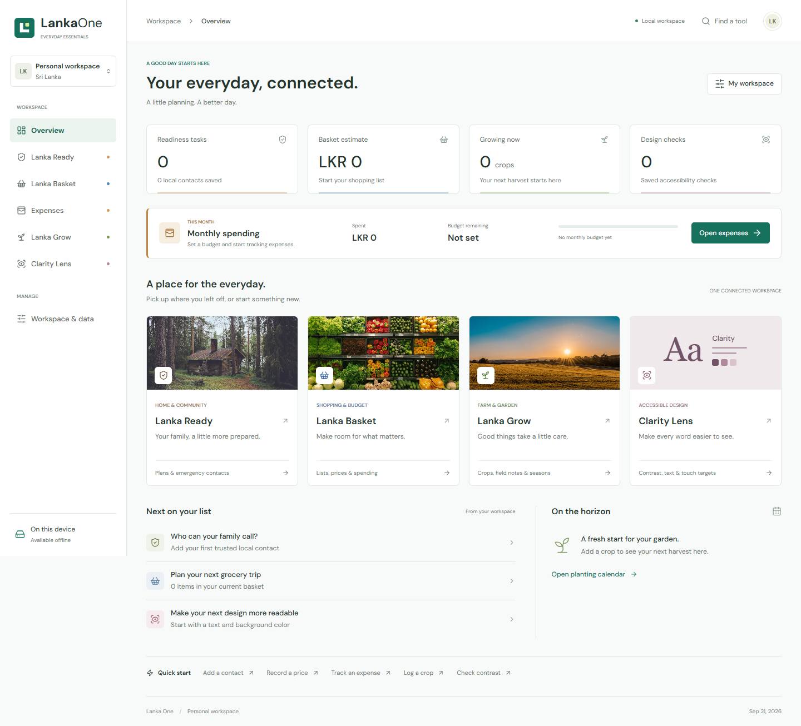

# Lanka Projects

This repository contains my local web projects, with **Lanka One** as the main featured project.

## Featured Project: Lanka One

Lanka One is a local-first everyday essentials workspace built for personal planning, household readiness, budgeting, crop tracking, and accessibility checks. It combines several practical tools into one connected browser-based workspace.



## Lanka One Technologies

- HTML
- CSS
- JavaScript
- Node.js
- LocalStorage
- Service Worker
- Playwright

## What Lanka One Includes

- Readiness planning with tasks, supplies, contacts, and printable plans.
- Shopping and budget tracking with local price lists and CSV export.
- Monthly expense tracking with income, expense records, and category insights.
- Crop tracking with harvest dates, farm logs, and seasonal planning.
- Accessibility checks for contrast, text sizing, and target sizing.
- Local browser storage with backup and restore support.

## Open Lanka One

Project folder:

```text
lanka-one
```

Run locally:

```powershell
cd lanka-one
npm install
npm run build
npm start
```

Then open:

```text
http://localhost:4180
```

## Repository Cover Image

Use this image for the GitHub social preview:

```text
lanka-one/docs/lanka-one-social-preview.png
```
